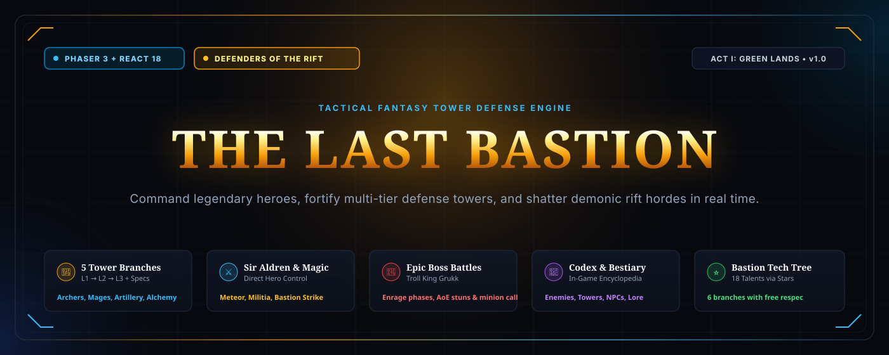
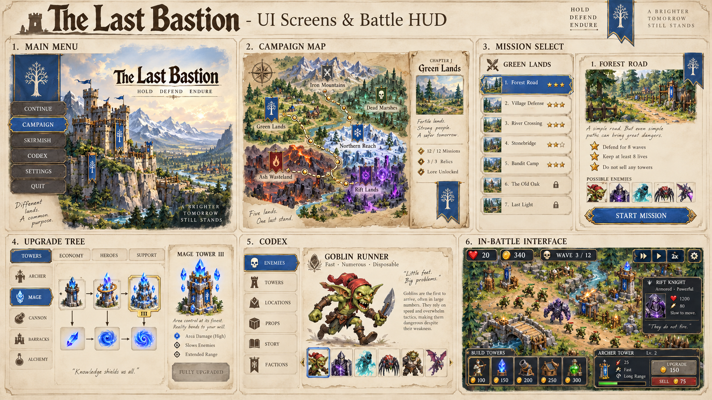
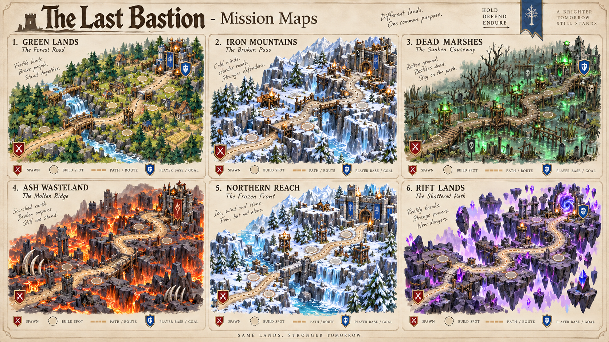
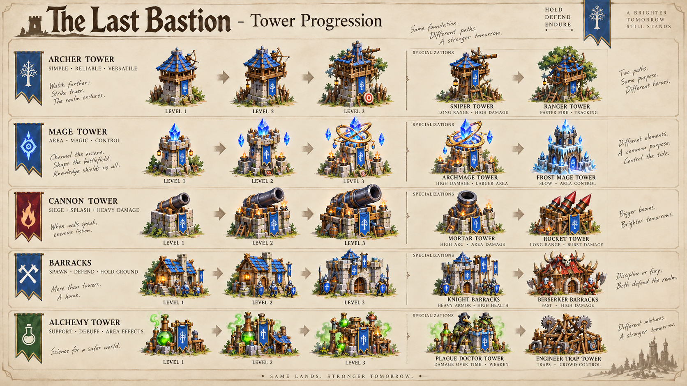
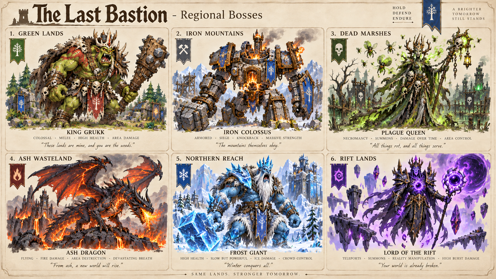
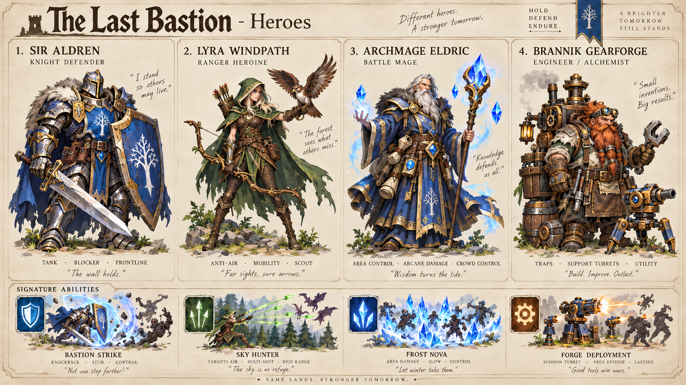
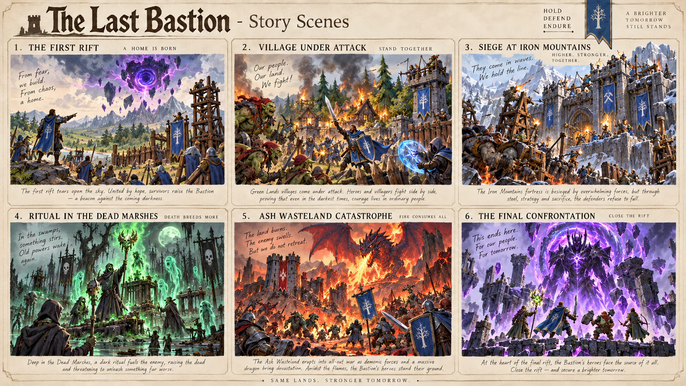
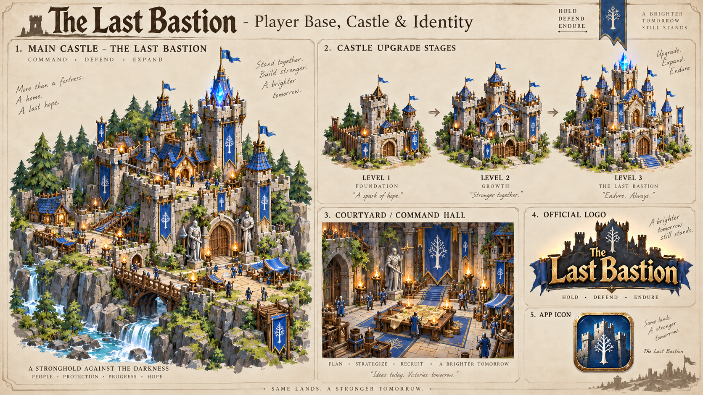

# The Last Bastion — Tactical Fantasy Tower Defense Game

<div align="center">

[](https://react.dev/)
[](https://phaser.io/)
[](https://www.typescriptlang.org/)
[](https://vitejs.dev/)
[](https://zustand-demo.pmnd.rs/)
[](https://vitest.dev/)
[](https://phaser.io/)
[](LICENSE)

---

### Next-generation browser-based fantasy Tower Defense game powered by a hybrid Phaser 3 and React 18 architecture. Command the legendary Paladin hero Sir Aldren, develop 5 distinct tower classes across 3 upgrade tiers and specializations, unlock permanent meta-upgrades in the Star Tech Tree, and defend the realm against apocalyptic demonic Rift incursions!

</div>
<br />



<br />

---

## 🚀 Key Highlights

- ⚡ **High-Performance Hybrid Architecture (Phaser 3 + React 18)**: Hardware-accelerated WebGL/Canvas rendering delivers smooth 60 FPS performance across hundreds of active demonic units, ballistic projectiles, acid DoT pools, and explosive particles, seamlessly coupled with an instantaneous reactive UI layer powered by React 18 and Zustand 5.0.
- ⚔️ **Legendary Commander Hero & Real-Time Control (Sir Aldren)**: Direct point-and-click hero positioning on the battlefield, automatic melee engagement with the enchanted Sunforge blade, defensive infantry armor aura, out-of-combat health regeneration, and the active **«Bastion Strike»** ability (heavy AoE physical damage with a 2.5s ground stun).
- 🔮 **Global Commander Devastation Spells**: Call down a catastrophic **Meteor Strike** on any target coordinates to incinerate enemy formations and leave a residual burning DoT firestorm, or invoke **Call Militia** to summon fortified infantry directly onto the road for emergency breach interception.
- 🏹 **5 Modular Tower Classes with 3 Upgrade Tiers & Dual Specializations**:
  - **Archer Tower**: Scout Outpost → Ranger Fort → Sniper Spire (*Branches: Longbow Master / Heavy Crossbow*).
  - **Arcane Spire**: Apprentice Spire → Archmage Citadel → Ethereal Spire (*Branches: Chain Lightning / Disintegration Beam*).
  - **Siege Cannon**: Field Bombard → Heavy Battery → Dread Mortar (*Branches: Cluster Shrapnel / Eternal Napalm*).
  - **Royal Barracks**: City Garrison → Knight Outpost → Royal Paladin Guard (*Branches: Paladins of the Dawn / Greataxe Berserkers*).
  - **Alchemy Lab**: Alchemist Vat → Caustic Refinery → Plague Transmuter (*Effects: Armor Shred, Toxic Poison Clouds, Slow*).
- 👹 **Multi-Phase Regional Boss Encounters (Troll King Grukk)**: Massive 4,500 HP chieftain with dynamic enrage thresholds (70%, 40%, 20% health), ground-shattering **Ground Slam** AoE stuns, defensive barricade knockbacks, minion goblin reinforcements, and a dedicated top Boss Health Bar.
- 🗺️ **Comprehensive Regional Campaign (Act I: Green Lands)**: 6 hand-crafted tactical missions featuring unique terrain elevations, bridges, chokepoints, and wave compositions (*Forest Road, Village Crossing, Old Stone Bridge, Crystal Grove, Broken Mill, and Troll Pass*).
- 📜 **Interactive In-Game Codex & Encyclopedia (The Codex)**: Comprehensive five-tab illustrated compendium featuring the Enemy Bestiary, Defense Towers, Heroes & Leaders, Kingdom Regions, and the Ancient Lore of the Bastion Citadel.
- ⭐ **Bastion Star Tech Tree (18 Permanent Talents)**: Meta-progression system driven by stars earned during campaign victories across 6 distinct specialization paths (Archery, Sorcery, Artillery, Infantry, Alchemy, Commander) with full, free point redistribution at any time.
- 🎬 **Cinematic Story Moments & NPC Dialogue Briefings**: Mission briefings with portrait dialogue from Commander Elira and Archivist Rowan, tactical objectives, and illustrated narrative moments capturing key campaign turning points.
- 🌍 **Trilingual Internationalization Engine**: Full out-of-the-box localization across English (default), Ukrainian, and Russian with instantaneous on-the-fly switching and persistent player profile synchronization.
- 🎵 **Atmospheric Procedural Audio & Dynamic SFX**: Layered sound effects synthesized via the Web Audio API including wave battle horns, bow drawstrings, heavy bombard explosions, blade clashes, and triumphant victory fanfares.

---

## 📂 Architecture & Capability Matrix

| Subsystem / Module | Core Implementation & Capabilities | Technical & Visual Signals |
| :--- | :--- | :--- |
| **Phaser Engine Core** | 2D canvas game loop scene (`GameScene`) with WebGL renderer | Y-sorted isometric depth layering, spatial slot coordinate system, smooth curve interpolation via `PathFollower`. |
| **Bridge EventBus** | Decoupled, type-safe bidirectional event bus (`gameEventBus`) | Zero tight coupling between Phaser and React, sub-millisecond reaction times for player commands (`CMD_BUILD_TOWER`, `CMD_SET_SPEED`, `CMD_CAST_SPELL`). |
| **Tower Defense Engine** | 5 tower classes with targeting priority filters (`First`, `Strongest`, `Weakest`, `Closest`) | Weapon recoil animations, parabolic ballistic trajectories, persistent acid pools, physical armor vs. magic resistance damage formulas. |
| **Hero & Spells System** | Controllable paladin hero entity with global commander spells | Point-and-click wayfinding, attack range rings, cooldown management, cast VFX bursts (`vfx_summon_portal`, `vfx_explosion_aoe`). |
| **Enemy & Boss AI** | Multi-waypoint navigation, status effects (Slow, Armor Shred, Stun), regeneration | Sprite swaps, health bars, enrage animation triggers, minion horde spawning routines. |
| **Campaign Map Modal** | Interactive 6-stage regional campaign with interconnecting trails | Overlay on conceptual realm map `campaign_map_concept_bg.png`, star completion tracking (1–3), Rift Crystals counter, mission sidebar preview. |
| **Codex Modal** | Full-screen game encyclopedia with category tabs and detailed stat cards | Scout goblin full-body concept art, tower evolution tiers, fortress lore, and tactical commander tips. |
| **Star Tech Tree** | 18-talent upgrade grid spanning 6 strategic defense paths | Dynamic multiplier recalculations, real-time node unlocking, instant talent refunding, `localStorage` profile persistence. |
| **HUD & Inspectors** | Top resource bar, radial build wheel, tower and enemy inspection cards | Real-time unit attribute inspection, time scale controls (1x, 2x, 3x), pause toggle (Space), early wave dispatch button. |
| **Localization & Save** | Translation manager `i18n` + profile validator `SaveService` | Automatic save schema migrations, English / Ukrainian / Russian language selection, high score tracking and unlocked stage persistence. |

---

## 🖼️ Screenshots & Feature Showcase

<div align="center">

### 1. Real-Time Battlefield & Battle HUD

_Phaser 3 battlefield layout featuring slot-based tower construction, range indicators, incoming demonic Rift waves, top resource HUD, and Sir Aldren's active ability panel._



---

### 2. Campaign Mission Maps & Strategic Routes

_High-definition battlegrounds for all 6 Act I missions: Forest Road, Village Crossing, Old Stone Bridge, Crystal Grove, Broken Mill, and Troll Pass._



---

### 3. Tower Progression: Level 1 → Level 2 → Level 3 → Specialization

_Visual and mechanical evolution across all 5 tower classes: Archers, Arcane Mages, Siege Cannons, Royal Barracks, and Alchemy Laboratories with dual specialization branches._



---

### 4. Regional Bosses & Apocalyptic Rift Chieftains

_Formidable regional bosses led by Troll King Grukk, featuring multi-phase enrage mechanics, ground-slamming AoE stuns, and horde reinforcements._



---

### 5. Legendary Heroes & The Order of the Dawn

_Lord Commander Sir Aldren, elite Royal Guard paladins, and Order magisters holding the frontline against demonic breaches._



---

### 6. Cinematic Story Moments & Campaign Chronicles

_Narrative artwork depicting key milestones: the first awakening of the demonic Rift, the march toward ancient ruins, crossing the murky swamps, and storming the bastion gates._



---

### 7. The Bastion Fortress, Castle Identity & Official Iconography

_The heart of civilization — The Last Bastion: castle fortification stages, grand command hall, official heraldic logo, and game application icon._



</div>

---

## 🛠️ Tech Stack & Engineering Highlights

```
┌─────────────────────────────────────────────────────────────────────────────┐
│                       THE LAST BASTION ARCHITECTURE                         │
├───────────────────────────────┬─────────────────────────────────────────────┤
│ Core Game Engine              │ Phaser 3.80+ (Canvas & WebGL Render)        │
│ UI & Presentation Layer       │ React 18.3 + TypeScript 5.6 (Strict Mode)   │
│ Global State & Bridge         │ Zustand 5.0 + Custom Type-Safe EventBus     │
│ Build Tool & Dev Server       │ Vite 5.4 (Rollup, ESBuild, HMR)             │
│ Audio Synthesis & FX          │ Web Audio API (AudioContext, GainNodes)     │
│ Styling & Fantasy Theming     │ Modular Vanilla CSS3 + Drop-Shadow Filters  │
│ Unit Testing Framework        │ Vitest 2.1 (Combat, Waves, Economy Tests)   │
└───────────────────────────────┴─────────────────────────────────────────────┘
```

### 1. Type-Safe Bidirectional EventBus Bridge (Phaser ↔ React/Zustand)
The Phaser 3 game loop runs at 60 FPS while the React UI renders overlays, modals, and inspection panels without frame drops by utilizing a decoupled event pipeline:

```typescript
// src/game/events/gameEventBus.ts
export const GameEvents = {
  STATE_UPDATED: 'STATE_UPDATED',
  CMD_BUILD_TOWER: 'CMD_BUILD_TOWER',
  CMD_UPGRADE_TOWER: 'CMD_UPGRADE_TOWER',
  CMD_SELL_TOWER: 'CMD_SELL_TOWER',
  CMD_CAST_SPELL: 'CMD_CAST_SPELL',
  CMD_MOVE_HERO: 'CMD_MOVE_HERO',
  CMD_TOGGLE_PAUSE: 'CMD_TOGGLE_PAUSE'
} as const;

// Synchronizing game snapshot with the reactive Zustand store
gameEventBus.on(GameEvents.STATE_UPDATED, (snapshot: GameStateSnapshot) => {
  useGameStore.setState({ gameState: snapshot });
});
```

### 2. Dynamic Tower Evolution & Armor Piercing Calculations
When a tower is upgraded (`L1 → L2 → L3`), `TowerEntity` swaps textures dynamically using concept pack sprites, recalculating range fields and damage formulas on the fly:

```typescript
// src/game/entities/towerEntity.ts
public upgrade(): boolean {
  this.definition = nextTierDefinition;
  this.level = this.definition.tier;
  
  // Swap to the corresponding visual asset tier
  const textureKey = `tower_${this.definition.towerClass}_l${this.level}`;
  this.sprite.setTexture(textureKey);
  this.recalculateStatsWithTechTree();
  return true;
}
```

### 3. Direct Paladin Hero Positioning & Active Ability Execution
Sir Aldren navigates the battlefield with point-and-click wayfinding, automatically intercepting enemies within aggro range and unleashing ground-cleaving strikes:

```typescript
// src/game/entities/heroEntity.ts
public castBastionStrike(): void {
  audioManager.playSfx('hero_ability');
  const enemiesInRange = this.scene.findEnemiesInRadius(this.x, this.y, 140);
  for (const enemy of enemiesInRange) {
    enemy.takeDamage(180, 'physical');
    enemy.applyStun(2500); // 2.5-second area stun
  }
  this.scene.vfxManager.spawnExplosion(this.x, this.y, 1.2);
}
```

---

## 📁 Directory Structure

```
the-last-bastion/
├── docs/
│   ├── assets/
│   │   ├── banner_marquee.svg              # Vector GitHub showcase banner
│   │   ├── screenshot_1_battle_hud.png     # Battlefield & battle HUD screenshot
│   │   ├── screenshot_2_mission_maps.png   # Regional campaign mission maps
│   │   ├── screenshot_3_tower_progression.png # 5-class tower evolution tiers
│   │   ├── screenshot_4_bosses.png         # Regional bosses showcase
│   │   ├── screenshot_5_heroes.png         # Hero and paladins showcase
│   │   ├── screenshot_6_story_scenes.png   # Cinematic storyline moments
│   │   └── screenshot_7_castle_identity.png # Castle Fortress & game identity
│   ├── GAME_DESIGN_DOCUMENT.md             # Core game balance & mechanics GDD
│   ├── TECHNICAL_ARCHITECTURE.md           # System architecture specifications
│   └── IMPLEMENTATION_PLAN.md              # Milestones & development roadmap
├── public/
│   ├── assets/
│   │   ├── enemies/                        # Enemy sprites (goblins, sappers, boss)
│   │   ├── heroes/                         # Sir Aldren sprites, portrait & abilities
│   │   ├── maps/                           # 1920x1080 high-res battlefield maps
│   │   ├── portraits/                      # NPC dialogue portraits
│   │   ├── projectiles/                    # Arrows, magic bolts, cannonballs
│   │   ├── scenes/                         # Cinematic storyline moments
│   │   ├── towers/                         # 5 tower classes (L1–L3 + specs)
│   │   ├── ui/                             # Official logo, app icon, fortress art
│   │   └── vfx/                            # Particle bursts, acid pools, explosions
│   ├── favicon.png                         # Browser tab icon
│   └── favicon.svg                         # Vector favicon
├── src/
│   ├── core/                               # Pure game logic and type definitions
│   │   └── types/                          # Interfaces for towers, enemies, maps, waves
│   ├── game/                               # Phaser 3 game engine layer
│   │   ├── entities/                       # Towers, enemies, heroes, projectiles
│   │   ├── events/                         # EventBus bridge between Phaser and UI
│   │   ├── scenes/                         # BootScene, PreloadScene, GameScene
│   │   └── systems/                        # VFX manager, audio, targeting algorithms
│   ├── content/                            # Data-driven game content registries
│   │   ├── maps/                           # 6 Act I map configurations
│   │   ├── missions/                       # 6 campaign mission definitions
│   │   ├── towers/                         # 5-class balance and stats
│   │   ├── waves/                          # Wave spawner definitions
│   │   └── registry.ts                     # Central content registry
│   ├── services/                           # Audio, internationalization (i18n), saves
│   ├── ui/                                 # Reactive UI layer (React 18)
│   │   ├── hud/                            # TopHud, HeroAndSpellsPanel, BossHealthBar
│   │   ├── panels/                         # BuildMenu, TowerInspector, EnemyInspector
│   │   ├── screens/                        # CampaignMapModal, TechTreeModal, CodexModal
│   │   └── store/                          # Zustand global game store
│   ├── App.tsx                             # Root UI orchestrator
│   └── main.tsx                            # React DOM entry point
├── tests/                                  # Automated unit test suite (Vitest)
│   ├── combat.test.ts                      # Damage calculations & armor resistance tests
│   ├── economy.test.ts                     # Gold economy, rewards & upgrade costs tests
│   ├── targeting.test.ts                   # Tower targeting prioritization tests
│   └── waves.test.ts                       # Wave spawner & pacing tests
├── index.html                              # Semantic HTML5 entry page
├── package.json                            # Project dependencies and npm scripts
├── tsconfig.json                           # TypeScript strict configuration
└── vite.config.ts                          # Vite 5 bundler configuration
```

---

## 🎮 Game Controls & Keyboard Shortcuts

| Key / Action | Command | Description |
| :---: | :--- | :--- |
| `Space` | **Pause / Resume** | Instantly freeze or resume game time |
| `1` / `2` / `3` | **Time Scale** | Toggle between Normal (1x), Fast (2x), and Turbo (3x) game speed |
| `W` | **Early Wave Call** | Call the next wave immediately to gain bonus gold |
| `Q` | **Bastion Strike** | Trigger Sir Aldren's cleaving ground stun ability |
| `Left-Click` on ground | **Move Hero** | Direct Sir Aldren to a new tactical battlefield position |
| `Left-Click` on empty slot | **Build Wheel** | Open the radial construction menu to select 1 of 5 tower classes |
| `Left-Click` on tower | **Tower Inspector** | View stats, upgrade to next tier, or sell tower for gold refund |
| `Left-Click` on enemy | **Enemy Inspector** | View live health, armor ratings, magic resistance, and unit description |
| `~` / `` ` `` | **DevTools** | Toggle the developer cheat panel (infinite gold, lives, wave skip) |
| `Esc` | **Clear / Close** | Deselect active slots or close open modal windows |

---

## ⚡ Quick Start & Local Development

### Prerequisites
- **Node.js**: v18.x or higher (LTS v20+ recommended)
- **npm** or **yarn**

### Installation & Run
```bash
# 1. Clone the repository
git clone https://github.com/Solod-S/the-last-bastion.git

# 2. Navigate into the project folder
cd the-last-bastion

# 3. Install project dependencies
npm install

# 4. Start the local development server
npm run dev
```
Open [http://localhost:3000](http://localhost:3000) (or the URL displayed in your terminal) to play the game with instant Hot Module Replacement.

### Testing & Quality Assurance
```bash
# Run automated Vitest unit test suite
npm test

# Run strict TypeScript type verification
npx tsc --noEmit
```

### Production Build
```bash
# Compile TypeScript and bundle optimized static assets into dist/
npm run build

# Preview the production static bundle locally
npm run preview
```

---

## 🚀 Deployment

The project compiles into a 100% static client-side bundle (`dist/`) that can be deployed instantly to any edge hosting platform:

- **Vercel**: Import the repository; the Vite framework preset is detected automatically (`npm run build`, output: `dist`).
- **Cloudflare Pages**: Connect the repository, select `Vite` preset, command `npm run build`, output directory `dist`.
- **Netlify**: Set build command to `npm run build` and publish directory to `dist`.
- **GitHub Pages**: Deploy the `dist` directory via a GitHub Actions workflow or the `gh-pages` branch.

---

## 📄 License & Credits

- **Author & Developer**: [Solod Sergey](https://github.com/Solod-S)
- **License**: Released under the [MIT License](LICENSE).
- **Inquiries & Support**: Contact via [solik098@gmail.com](mailto:solik098@gmail.com) or connect on [GitHub](https://github.com/Solod-S).
